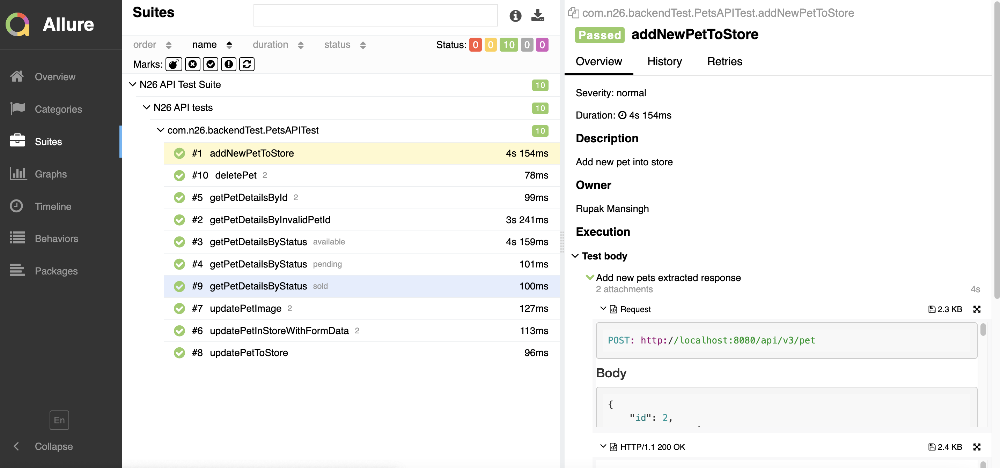

# API Automation Test Suite

<br/>This is the solution for `task 3` (REST API testing) mentioned in tech home challenge .

# Tools, Framework,Programming Language used:

- RestAssured : Java library for testing restful API
- maven : Build automation tool
- TestNG : Testing framework for java programming language
- Java : Automation Scripting language
- Hamcrest : Used for assertions
- lombok : Used for setter and getter methods

# Development environment :

* All development and execution done on Mac OS, should work on other OS(e.g windows) as well.

### Pre-requisite

- java 8+
- Apache Maven
- M2_HOME path should be set
- Lombok plugin in IDE
- Docker

# Features and structure of framework:

* TestNG:
    * To perform parallel execution of test.
* Client Model Architecture:
  -RestAssured client consist all type of request (e.g GET,POST etc) and Model class(POJO class) contains the response
  to valid output.
* Schema validation:
    * Validate the response by json schema validator.
* Configurator(via testng.xml file):
    * run tests in parallel mode;
        - Test cases executed in parallel with maximum thread count of 4.
* Allure report:
  *Integrate to defect tracking system by using @link
  *Test order by severity by using @Severity annotation.
  *Tests groups with @Epic, @Feature, and @Stories annotations.
  *Report contains the method, body, header, CURL for api request.
  *Report contains the status code, header, body for api response.

## Test Scenarios

1. Add pet to the store.
2. Get pet details with valid and invalid pet ID.
3. Get pet details with status(e.g available, pending,Open).
4. Update the pet in store with form data.
5. Update store pet in store.
6. Update the pet image.
7. Delete Pet by using pet ID.

### Set up the environment and make the service up

* Expose port 8080 from the image and access pet store via the exposed port
   ```
   docker pull swaggerapi/petstore3:unstable
   docker run  --name swaggerapi-petstore3 -d -p 8080:8080 swaggerapi/petstore3:unstable
   ```

## How to RUN

### Two ways to run tests

a) Using command prompt

- Clone the repo `https://github.com/rupak101/rupak-mansingh.git`
- Execute `cd n26-task3`
- Run the below command
  ```
  mvn clean test
  ```
- Run the command to generate allure report and open in a browser:
  ```
  mvn allure:serve
  ```

b) Using IDE :

- Go to github, clone the repo `https://github.com/rupak101/rupak-mansingh.git`
- Open folder `n26-task3 ` in IDE.
- IDE should have lombok plugin.
- Find `testng.xml`
- Right click on it and run the tests.

# Report : Allure Reporting

- HTML Reports are available in the "/target/allure-report" directory having details of each test case execution.

## Observation:

* Inconsistency in error message across APIs.As some end point return proper json error message, 
  but some end point return plain text message without error code.

## Possible Enhancements:

* Containerise the whole setup by using docker.
* Add the tests to CI(e.g jenkins, gitlab CI) pipeline.
* Publish the report to collaboration tool (e.g slack).

## Test Scenarios:

- Passed Scenario - Easy to navigate and see the steps which the tests have executed.
  